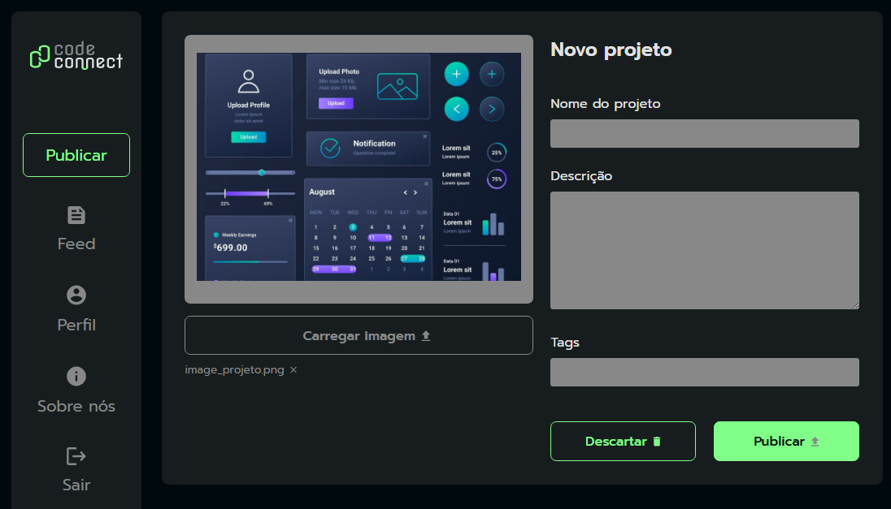
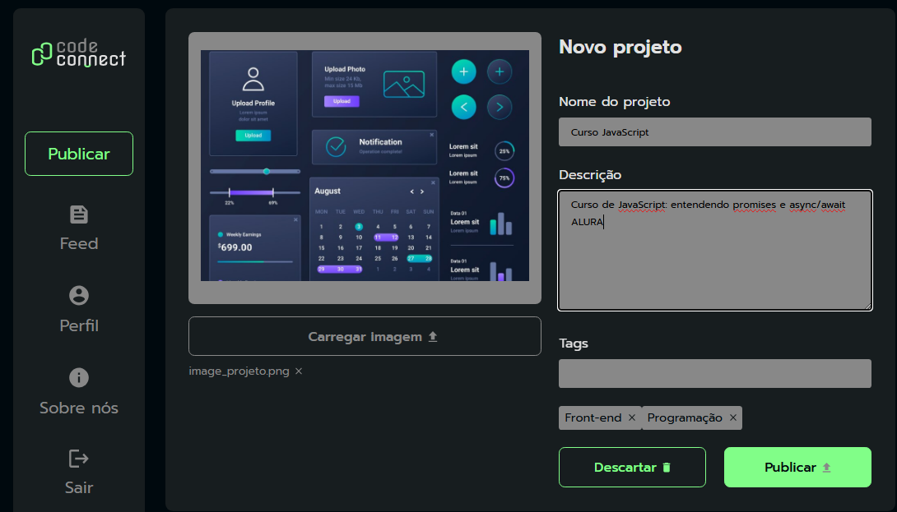

# 📦 CodeConnect


> Uma plataforma simples para **publicar projetos**, adicionar **tags** e fazer upload de imagens de forma prática.

---

## 🚀 Sobre o Projeto

O **CodeConnect** é um projeto desenvolvido para praticar **HTML, CSS e JavaScript** no **Curso de JavaScript: entendendo promises e async/await** da *Alura* com foco em:

- Upload e pré-visualização de imagens;
- Adição e remoção de tags dinâmicas;
- Formulário interativo com botões de ação (`Publicar` e `Descartar`);
- Estilo moderno e responsivo com **CSS custom properties**.

Este projeto é perfeito para quem quer aprender **DOM Manipulation**, **Eventos** e boas práticas no front-end.

---

## 🖼️ Demonstração

<br>


---

## 🛠️ Tecnologias Utilizadas

- **HTML5** para a estruturação;
- **CSS3** com variáveis (`:root`) para cores e design;
- **JavaScript** para interatividade (DOM, eventos e promises);
- **Google Fonts** (Prompt).

---

## 📂 Estrutura de Pastas

```bash
.
├── index.html           # Página principal
├── styles.css           # Estilização da página
├── scripts.js           # Lógica e interatividade
├── img/                 # Imagens e ícones do projeto
└── README.md            # Documentação
